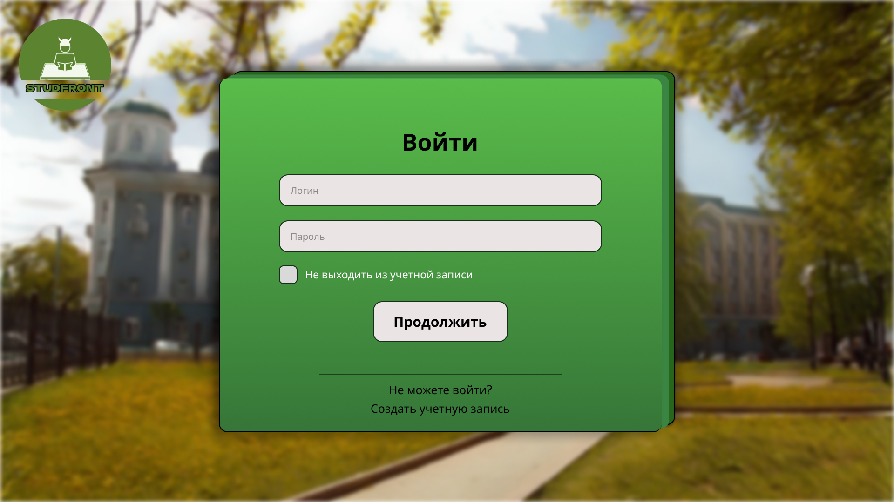
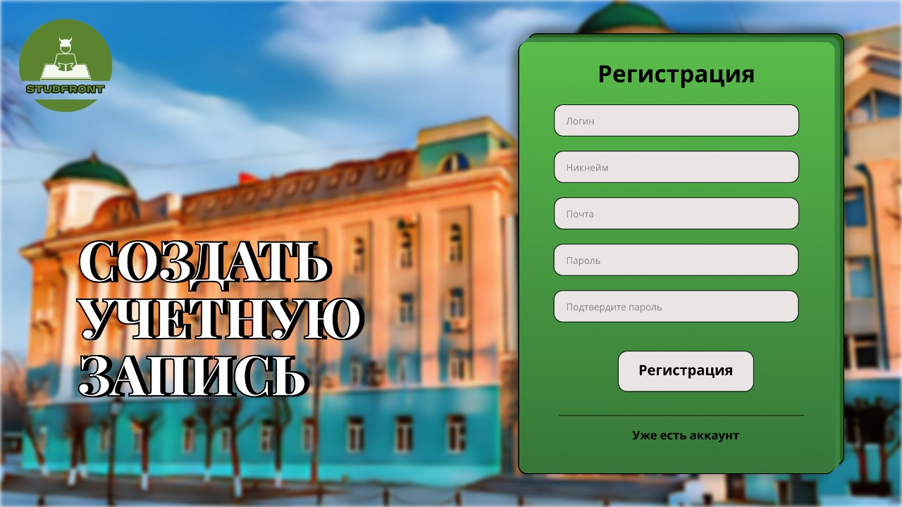
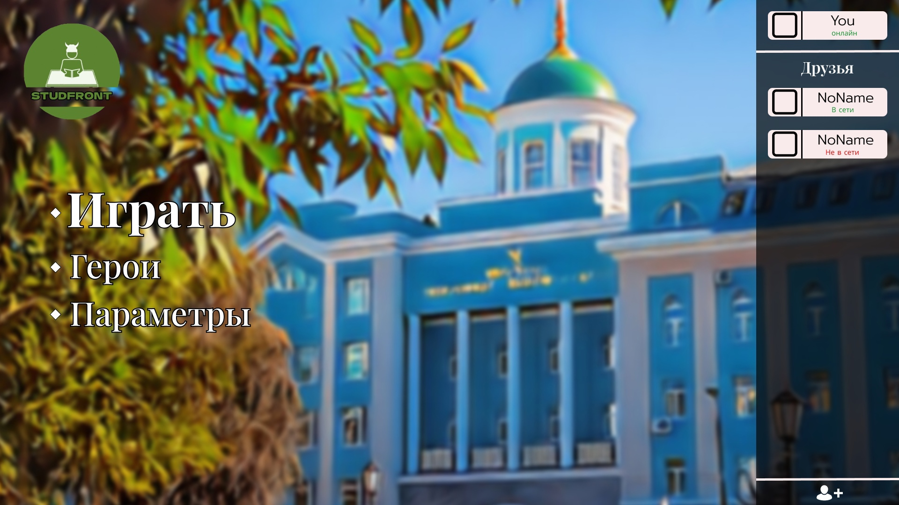
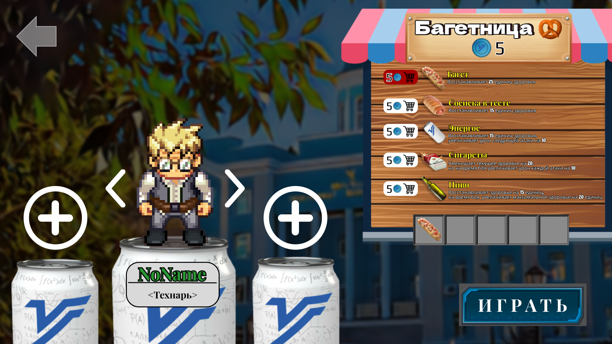
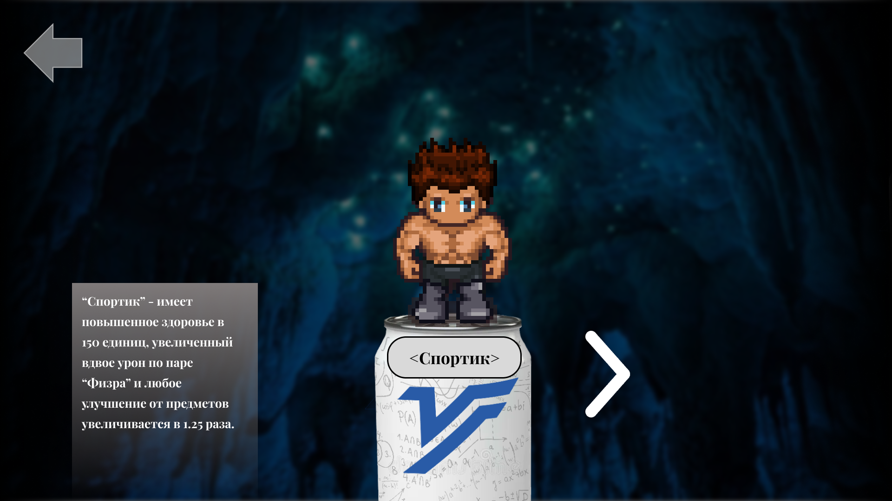
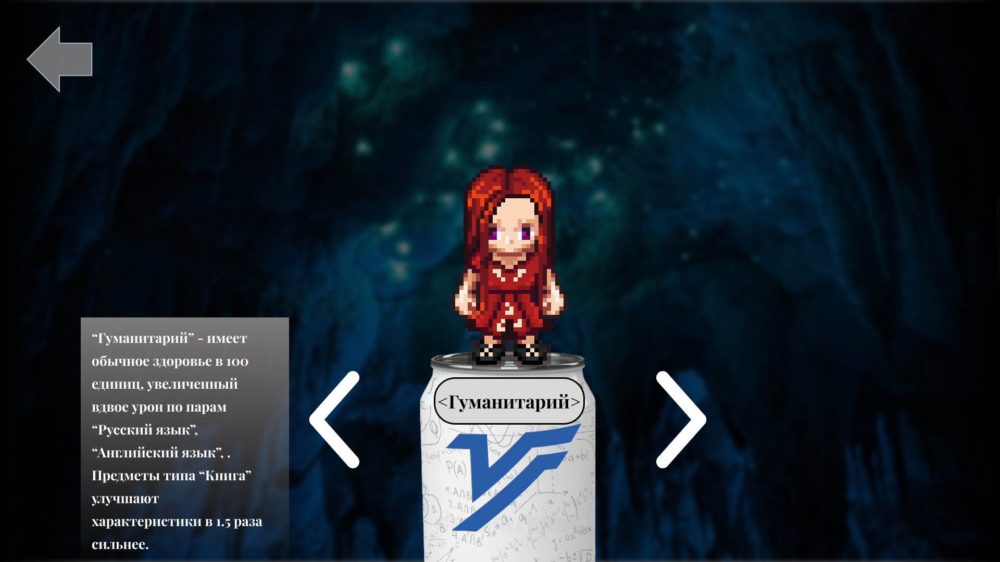
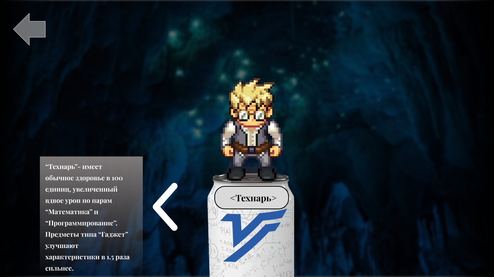
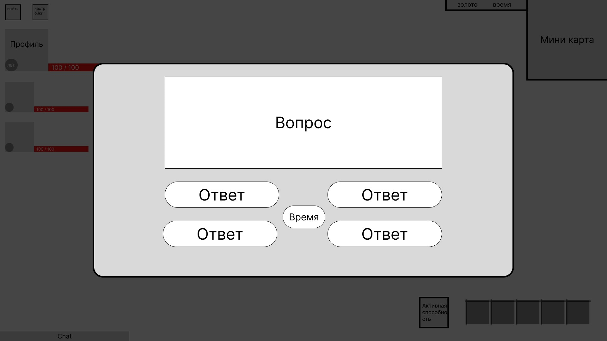
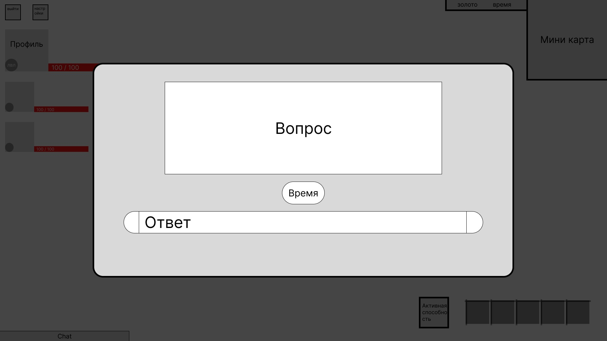

# ТЕХНИЧЕСКОЕ ЗАДАНИЕ

## STUDFRONT

### Содержание:

1. Термины и определения
2. Цели и задачи
3. Интерфейс
    - 3.1. Экран входа
    - 3.2. Экран регистрации
    - 3.3. Главное меню
    - 3.4. Лобби
    - 3.5. Игровой интерфейс
4. Игровой процесс
    - 4.1. Общая концепция
    - 4.2. Геймплей
    - 4.3. Герои
    - 4.4. Предметы
        - 4.4.1 Список предметов
        - 4.4.2 Багетница
    - 4.5. Бой
       - 4.5.1 Враги
       - 4.5.2 Боевая система
    - 4.6. Мультиплеер
    - 4.7. Система уровней
5. Пользовательские сценарии

### Версия документа(обновляется по ходу разработки):

1.0 (15.10.23) Документ создан и наполнен

1.1 (16.10.23) Исправлены баги в разделах 1, 3.2, 3.3, 5.

1.2 (24.10.23) Добавлена информация в раздлы 4.2 и 4.5 

1.3 (16.12.23) Добавлены новые разделы 4.5.1, 4.5.2, дополнены разделы 4.2, 5, 3.3, 4.4.1  (текущая).

## 1. Термины и определения

-   Игрок – пользователь, вошедший в игру
-   Герой – игровой юнит, которым игроку предстоит управлять.
-   Курс – ограниченная локация, внутри которой происходят все игровые активности. Подразумевается наличие нескольких курсов, переход между которыми осуществляется посредством победы над финальным противником (преподом)
-   Комната – небольшое подпространство внутри каждого курса, в котором находится n-ое количество “пар”. Подразумевается наличие нескольких комнат на каждом курсе.
-   Пара – основной противник игрока, существует несколько типов, каждый из которых привязан к одной из учебных дисциплин.
-   Препод – финальный противник каждого курса
-   Багетница – игровой магазин
-   Характеристики – индивидуальные для каждого героя параметры, влияю-=-
-   Предмет – игровой объект, которой можно получить посредством победы над противниками. Улучшает различные характеристики героев или восстанавливает здоровье
-   УДгУкоин – игровая валюта, дается за каждого побежденного противника.
-   Лобби - игровой интерфейс, который служит переходным этапом между меню и игрой. Здесь можно приобрести предметы за игровую валюту
-   Друзья - пользователи, которых игрок добавил в свой френдлист, основные взаимодействия: “пригласить в лобби” и “удалить из друзей”
-   Френдлист - интерфейс в главном меню со списком друзей.
-   Никнейм - псевдоним игрока внутри игры

## 2. Цели и задачи

Цель - реализовать веб-приложение в рамках учебного проекта.

Задачи:

-   Грамотно распределить задачи, чтобы соблюдать все дедлайны.
-   Реализовать клиентскую часть проекта.
-   Реализовать серверную часть проекта.
-   Протестировать работу приложения.
-   Сдать проект заказчику.

## 3. Интерфейс

### 3.1 Экран входа

Состоит из двух полей ввода:

-   Логин
-   Пароль

Трех кнопок:

-   “Продолжить”
-   “Не можете войти?”
-   “Создать учетную запись”

И переключаемая функция “Не выходить из учетной записи”, при активации которой пользователю не придется авторизовываться снова при каждом новом входе.

### 3.2 Экран регистрации

Состоит из четырех полей ввода:

-   Логин
-   Никнейм
-   Почта
-   Пароль
-   Подтверждение пароля

И двух кнопок:

-   “Регистрация”
-   “Уже есть аккаунт”

Требования к логину:

1. Логин должен начинаться с буквы и состоять не менее чем из 5 символов и не более чем из 12 символов.
2. При создании логина можно использовать латинские буквы, цифры, подчеркивания (\_) и точки (.).
3. Знак @ в логине недопустим.
4. Пробел в логине недопустим.
5. Логин не может заканчиваться точкой.

Требования к паролю:

1. Содержит не менее 8 символов.
2. Содержит символы, набранные в разных регистрах.
3. Помимо латинских букв, содержит также цифры и/или специальные символы.
4. Не является персональной информацией (имена, адреса, дата рождения, телефон и т.п.)

### 3.3 Главное меню

В левой части меню расположены кнопки:

-   Играть
-   Герои
-   Параметры

В правой части расположен интерфейс, который отображает добавленных друзей и их текущий статус (“В сети” или “Не в сети”).
Внизу этого интерфейса расположена кнопка "+" позволяющая добавлять в друзья других пользователей.
Чтобы добавить друга пользователь должен нажать на эту кнопку и ввести в появившемся окне с полем ввода никнейм игрока которго хочет добавить в друзья.

Во вкладке параметры присутствуют следующие настройки:
- Громкость звука
- ВКЛ/ВЫКЛ полноэкранный режим

## 3.4 Лобби

На экране представлены два основных интерфейса:

-   Текущий состав команды
    -   Здесь отображается текущий состав команды, выбранный каждым игроком герой, а также предметы игрока.
    -   Друзья приглашаются в команду посредством кнопки “+”.
-   “Багетница”

А также две кнопки “Играть” и “<-” в правом нижнем и левом верхнем углах соответственно.

-   “Играть” - запускает игровую сессию.
-   “<-” - возвращает назад в меню.

## 3.5 Игровой интерфейс

Интерфейс игры предоставляет игроку информацию о:

-   Всех игроках в команде, их текущем здоровье и уровне.
-   Текущем количестве игровой валюты.
-   Времени, прошедшем со старта игры.
-   Текущих предметах игрока.

Также интерфейс содержит миникарту и окно чата.

## 4. Игровой процесс

### 4.1 Общая концепция

Игра “STUDFRONT” представляет собой симулятор студента-должника, в котором уровни генерируются случайным образом при каждой новой игре. Задачей игроков является избежать отчисления из ВУЗа и развитие своего персонажа. При смерти персонажа игрок начинает заново, но с сохранением части прогресса персонажа. После входа в игру игрок может создать свое "лобби" - собственную игровую комнату, к которой могут присоединиться другие игроки для совместной игры. Цель игры - погасить все долги и успешно закончить ВУЗ, побеждая различных мобов. У игрока есть выбор из трех персонажей: “Технарь”, “Спортик” или “Гуманитарий”. В конце каждого курса находится босс (препод), которого необходимо победить для прохождения уровня. Чем больше игроков в команде, тем больше противников и сложнее игра. Противники оставляют УдГУ-коины, на которые игроки могут приобрести очки опыта и предметы в “Багетнице”.

### 4.2 Геймплей

1. Игрок запускает игру в браузере.
2. Его встречает экран входа, если игрок уже зарегистрирован, он вводит логин и пароль и переходит к игре. Если нет, то регистрируется.
3. После входа появляется главное меню, в котором можно перейти к игре, зайти в настройки, посмотреть информацию о героях или выйти.
4. Нажав кнопку “Играть”, пользователя переносит в игровое лобби, в котором можно выбрать героя, собрать команду, посмотреть какие у персонажа имеются предметы в инвентаре, а также доступна “Багетница” - магазин в котором можно приобрести улучшения или предметы за игровую валюту.
5. Выбор героя из трех: “Спортик”, “Технарь” и “Гуманитарий”.
6. Когда герои выбраны и все готовы, игра запускается.
7. Игроки появляются на первом курсе (этаже), который является неким обучением, которое помогает разобраться с управлением, механикой сражения и понять, что требуется от игрока для успешного прохождения.
8. Управление персонажем происходит с помощью клавиш “w”, “a”, “s”, “d”.
9. На каждом этаже расположено определенное количество комнат, зайдя в которые, игрокам придется сражаться с “парами”.
10. Как только противник оказывается в радиусе атаки персонажа, начинается сражение. Чтобы наносить удары по врагу, необходимо решать задачи по математике, русскому, программированию и другим различным учебным дисциплинам.
11. После успешного решения задачи у игрока появляется возможность нанести удар по врагу, если же задача решена неправильно, то враг наносит удар по персонажу (или по персонажам, если в команде несколько игроков).
12. Наносимый урон зависит от выбранного персонажа и предметов. После победы над всеми противниками в комнате, помимо валюты, которую враг оставляет после своего поражения, игрокам дается награда за ее прохождение (игровая валюта и различные улучшения).
13. Когда все комнаты на этаже пройдены, остается главный босс - преподаватель, которому нужно закрыть долг.
14. Сражение с боссом похоже на обычное, но ограничено время, отведенное на ответы к заданиям. Чем меньше остается здоровья у босса, тем меньше времени дается игрокам.
15. После победы вся команда автоматически переместится в лобби, где можно будет воспользоваться “Багетницей” и перейти на следующий курс.
16. Если же во время прохождения курса один из персонажей погибает, остальные продолжают игру в меньшинстве до момента сражения с боссом, перед которым все мертвые персонажи возрождаются, но не получают всех бонусов от прохождения комнат.
17. В случае смерти всех игроков, игра начинается с первого курса с сохранением части достигнутого прогресса. 
Правила сохранения прогресса:
- Сохраняются только предметы и уровень персонажа
- Теряется вся игровая валюта
- Сохранение предметов и уровня на момент начала прохождения курса(т.е. игроки потеряют уровень и предметы, полученные на текущем курсе, если умрут во время его прохождения, не дойдя до следующего курса)
- Таймер, показывающий время с начала прохождения игры не сбрасывается после смерти всех игроков.
18. Всего в игре доступно 5 курсов(возможно добавление новых в будущем).
19. По прохождению всех доступных курсов игра считается пройденной. Но благодаря рандомной генерации комнат и этажей, играть можно бессчетное количество раз.

### 4.3 Герои

В игре представлено три персонажа: “Спортик”, “Технарь” и “Гуманитарий”. Каждый из них имеет собственные характеристики:

-   “Спортик”
    

-   “Гуманитарий”
    

-   “Технарь”
    

### 4.4 Предметы

#### 4.4.1 Список предметов

| Предмет              | Тип предмета | С каких пар выпадает                                                | Что даёт                                                                                           |
| -------------------- | ------------ | ------------------------------------------------------------------- | -------------------------------------------------------------------------------------------------- |
| Айфон                | Гаджет       | “Программирование”                                                  | Увеличивает урон по “Программированию” на 15 единиц                                                |
| Спортивки            | Одежда       | “Физра”                                                             | Увеличивает постоянное здоровье на 15 единиц                                                       |
| Пиво                 | Расходник    | Багетница                                                           | Восстанавливает здоровье на 15 единиц, на время боя увеличивает максимальное здоровье на 20 единиц |
| Энергос              | Расходник    | Багетница                                                           | Восстанавливает здоровье на 15 единиц, увеличивает урон следующей атаки на 10                      |
| Учебник              | Книга        | “Программирование”, “Математика”, “Русский язык”, “Английский язык” | Увеличивает урон по всем парам кроме “Физра” на 5 единиц                                           |
| Сигареты             | Расходник    | Багетница                                                           | Уменьшает текущее здоровье на 20, но на время боя увеличивает урон каждой атаки на 10              |
| Кофта “Stone Island” | Одежда       | “Физра”                                                             | Увеличивает максимальное здоровье на 15                                                            |
| Калькулятор          | Гаджет       | “Математика”                                                        | Увеличивает урон по “Математике” на 15 единиц                                                      |
| Словарь              | Книга        | “Русский язык”, “Английский язык”                                   | Увеличивает урон по “Русскому языку” и “Английскому языку” на 10 единиц                            |
| Ноутбук              | Гаджет       | “Программирование”, “Математика”                                    | Увеличивает урон по “Программированию” и “Математике” на 10 единиц                                 |
| Багет                | Расходник    | Багетница                                                           | Восстанавливает здоровье на 25 единиц                                                              |
| Сосиска в тесте      | Расходник    | Багетница                                                           | Восстанавливает здорвоье на 15 единиц                                                              |

Герой может одновременно носить с собой до 5 предметов в инвентаре

Предметы напрямую влияют на наносимый персонажем уроном. Так например:
Играя за Технаря и имея в инвентаре предмет “Ноутбук” урон одного удара по паре “Программирование” будет равен 55(20 стандартного урона всех персонажей, +20 бонус к урону у персонажа “Технарь” действующий на пары “Программирование” и “Математика”, +1.5*10(15) бонус к урону от предмета “Ноутбук” с множителем персонажа “Технарь”) 

#### 4.4.2 Багетница

Помимо предметов, после победы над врагами, игроки также получают валюту(УДгУкоины), которую можно потратить в Багетнице
В багетнице можно преобрести любой предмет типа “расходник” за. Стоимость любого предмета - 5 УДгУкоинов
Любой предмет в Багетнице можно купить лишь единожды, счетчик покупок сбрасывается с переходом на новый курс.

### 4.5 Бой
#### 4.5.1 Враги

Игровые противники представлены в виде пар по учебным дисциплинам
Всего присутствует пять видов:

-   "Программирование"
-   "Математика"
-   "Русский язык"
-   "Английский язык"
-   "Физра"

Финальные боссы в конце каждого курса - "преподы"
Каждый препод представляет собой мастера одной из представленых в игре учебных дисциплин, так:

Первый курс - препод по дисциплине "Русский язык"

Второй курс - препод по дисциплине "Физра"

Третий курс - препод по дисциплине "Математика"

Четвертый курс - препод по дисциплине "Английский язык"

Пятый курс - препод по дисциплине "Программирование"

Во время боя преподы нападают на всех игроков в команде. Пока случайный игрок решает задачу для нанесения урона, остальные должны всячески отвлекать препода на себя.

 
Все пары имеют одинаковые характеристики: 75 единиц здоровья и 20 урона.
Первый препод имеет 150 здоровья и 35 урона, каждый последующий имеет на 50 здоровья и 10 единиц урона больше предыдущего.
За каждого нового игрока в команде, препод становиться сильнее в 1.5 раза

#### 4.5.2 Боевая система

Бой начинается как только игрок приблизится вплотную ко врагу.
Наносить удары можно после того как дан правильный ответ на тематический вопрос (у "Программирование" вопросы про программирование, у "Математика" про математику и тд.)
Если дан неправильный ответ, то враг наносит удар по игроку.
Вопросы могут быть как с полем для ввода, так и с вариантами ответов.

#### Примеры:

В каждой комнате находится от 2 до 4 противников на игрока, т.е. если в команде трое игроков, то стоит ожидать от 6 до 12 врагов
В сражении с преподом участвуют все игроки из команды, соответственно здоровье босса увеличивается прямо пропорционально количеству игроков.

### 4.6 Мультиплеер

Игрок может собрать команду из трех человек, пригласив их в свое лобби из френдлиста.
Сражение и получение наград устроено следующим образом:

-   Чем больше игроков в команде, тем больше противников в каждой комнате и тем сильнее препод в конце курса.
-   Одновременно с одним противником может сражаться только один игрок.
-   Предметы выпадают только тому игроку, который победил противника.
-   При гибели одного из героев, команда продолжает игру в меньшинстве до момента сражения с боссом.
-   После гибели всех героев, игра начинается сначала с сохранением достигнутого прогресса (предметов и уровня).

### 4.7 Система уровней

В игре присутствуют уровни персонажей. Каждый новый уровень дает прибавку к урону и здоровью на 5 единиц.
Чтобы повышать уровни нужно побеждать врагов.
Максимальный уровень героя - 5.
| Уровень | Сколько нужно победить противников для получения |
| ------- | ----------------------------------------------- |
| 1 | 0 |
| 2 | 5 |
| 3 | 15 |
| 4 | 25 |
| 5 | 40 |

Любой босс считается за пятерых противников.

### 5. Пользовательские сценарии

#### Вход в игру:
Вход в игру:
Пользователь заходит на сайт и попадет на страницу авторизации.
   Пользователь зарегистрирован:
1. Вводит логин и пароль в соответствующих полях для ввода и нажимает на кнопку “Продолжить”.
2. Система обрабатывает данные, если в базе данных присутствуют введенные логин и пароль то пользователь попадает на страницу главного меню, если введенные данные не верные, то система выдает ошибку  '456'(Неверный логин или пароль),
   Пользователь не зарегистрирован:
1. Нажимает на кнопку “Создать учетную запись”.
2. Система перенаправляет пользователя на страницу регистрации.
3. На странице регистрации пользователю необходимо ввести всю необходимую информацию в поля для ввода и нажать на кнопку “Регистрация”.
4. Система обрабатывает данные, если введенные данные соответствуют требованиям, то система регистрирует пользователя, присваивает ему уникальный id и отправляет на страницу авторизации

#### Выход из игры:

Пользователь выходит в главное меню и закрывает страницу сайта.

#### Смена аккаунта: 
Пользователь находится в главном меню:
В левом нижнем углу находится кнопка “Сменить аккаунт”, нажав на которую система отключает пользователя от текущего аккаунта и отправляет на страницу авторизации.

#### Выбор героя:

Пользователь находится в главном меню:

1. Пользователь нажимает кнопку “Играть”.
2. Пользователь попадает в игровое лобби.
3. Изначально выбран случайный персонаж, чтобы его поменять пользователь нажимает на “<” или “>” слева и справа от выбранного персонажа соответственно.
4. Когда пользователь выбрал нужного персонажа он нажимает “Играть” или “Готов” в зависимости от того, находится ли он в команде или играет в одиночку.

#### Добавить друга:

Пользователь взаимодействует с френдлистом:
1. Пользователь нажимает на кнопку “+” в нижней части интерфейса
2. Появляется окно с полем ввода и кнопкой  “Добавить друга”.
3. В появившемся окне пользователь вводит никнейм игрока, которого хочет добавить в друзья и нажимает кнопку “Добавить друга”
4. После этого система ищет в базе данных игрока, никнейм  которого был введен в поле для ввода, если такой существует отправляет ему пригласительное письмо(запрос на добавление в друзья)
5. У игрока, которого пользователь добавил в друзья, после входа в игру появится пригласительное письмо, открыв которое он сможет или принять приглашение в друзья или отклонить
6. Если же игрок принимает приглашение пользователя, оба станут отображаться друг у друга во френдлисте

#### Отправка сообщений в чат:
Пользователь взаимодействует с окном чата:
1. Чтобы активировать окно чата пользователь наводит на него мышкой и нажимает ПКМ
2. Окно чата активируется и пользователь может написать туда свое сообщение и вписать id друга которому хочет его отправить.
3. После написания необходимого текста, пользователь нажимает кнопку Enter на клавиатуре или наводит мышкой на кнопку “Отправить”
4. Система отправляет сообщение нужному игроку(или всей команде в случае если игрок находится в лобби и не указал id игрока)

#### Создание лобби:
Пользователь находится в главном меню:
1. Пользователь нажимает на кнопку “Играть”
2. Система создает лобби и автоматически перемещает в него пользователя.

#### Пригласить друга в свое лобби:
Пользователь находится в лобби:
1. Пользователь нажимает кнопку “+” в пустом слоте команды
2. Появляется окно с доступными друзьями, которых можно пригласить в лобби
3. Пользователь выбирает друга которого хочет пригласить в команду и приглашает его.
4. Система отправляет приглашение в лобби второму пользователю
5. Друг появится в команде пользователя после того как примет приглашение вступить в команду

#### Выход из лобби

Пользователь находится в лобби:

1. Чтобы покинуть лобби другого игрока, пользвоатель нажимает кнопку “<-” в левом верхнем углу экрана
2. Пользователь перемещается в главное меню

#### Покупка предметов в Багетнице:
Пользователь находится в лобби, взаимодействует с интерфейсом багентицы:
1. Пользователь наводит курсор на предмет который хочет приобрести.
2. Пользователь нажимает ЛКМ по желаемому предмету.
3. Система проверяет баланс игровой валюты пользователя, и место в инвентаре.
4. Если у пользователя достаточно игровой валюты, и есть свободное место в инвентаре, то предмет покупается
5. Система обновляет информацию о текущем балансе пользователя и предметах в его инвентаре.

#### Старт игры:

Пользователь взаимодействует с игровым лобби:
Если пользователь находится в лобби один, то нажимает кнопку “Играть”.
Если пользователей несколько, кнопка “Играть” меняется на “Готов”, игра начнется как только все пользователи нажмут кнопку “Готов”.

#### Взаимодействие со врагами:
Пользователь управляет своим игровым персонажем(с помощью клавиш wasd):
1. Как только персонаж пользователя попадает в радиус активации боя врага, система начинает процесс боя.
2. Система генерирует случайное задание по нужному предмету(или берет из базы данных) и выводит перед пользователем окно с вопросом и полем ввода для ответа / вариантами ответов.
3. Пользователь вводит ответ в поле для ответа/выбирает нужные вариант ответ.
4. Система проверяет ответ на достоверность, в случае правильного ответа пользователь наносит удар врагу, в противном случае враг наносит удар по пользователю

#### Переход на следующий курc:

Пользователь одержал победу над финальным боссом курса:

1. Система отправляет пользователя в лобби.
2. Всей команде предлагается перейти на следующий курс.
3. После перехода вернуться назад можно только если все герои погибнут.

#### Завершение игры

Пользователь одержал победу над финальным боссом последнего курса:

1. Перед пользователем появляется экран который информирует его о завершении игры.
2. На экране пользователь может также узнать информацию о: времени прохождения и количестве побежденных врагов.
3. Пользователь нажимает кнопку “Далее” после чего попадает в главное меню.
